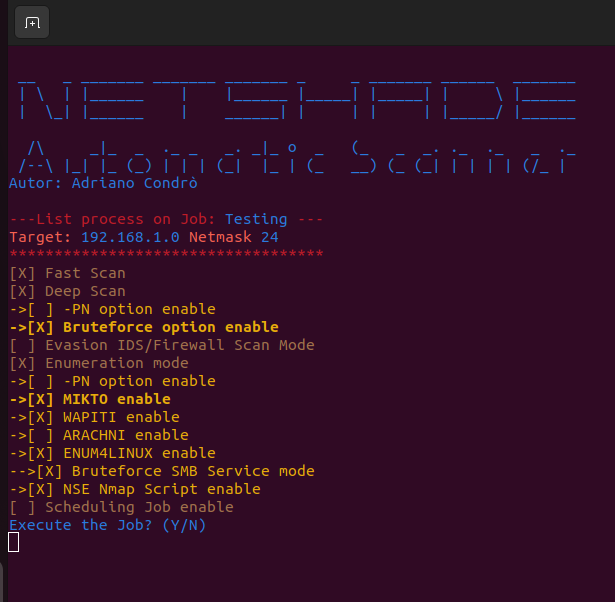

# NETSHADE Automatic Scanner

This script implements a network scanner which integrates Nmap, Enum4Linux, Ncrack, Nikto, Wapiti and Arachni.

The script allows you to use the various Firewall and IDS evasion methodologies implemented in Nmap.

It also allows you to schedule the various Jobs in order to carry out the scan and enumeration sequence set in the initial setup phase.

******************************************************************

The reference Linux distribution for installation is Ubuntu 22.04.

******************************************************************
1) Initially proceed to install the administrator dependencies:

```
sudo chmod 777 Root_Requirement.sh
```
```
sudo ./Root_Requirement.sh
```

******************************************************************
2) then proceed to install the non-administrator dependencies:

```
sudo chmod 777 Requirement.sh
```
```
sudo chmod 777 nmap-converter.py
```
```
sudo chmod 777 NetShade_Network_Scanner
```

```
./Requirement.sh
```
NOTE: Enter the root password if prompted (to delete shared folders)

******************************************************************
3) For use the script:

```
./NetShade_Network_Scanner
```

USE ROOT (SUDO) ONLY TEST EVASION MODE 

e.g.    sudo ./NetShade_Network_Scanner  (NOT USE FOR NOT EVASION OPERATION) 

NOTE:USING ROOT CAUSES ARACHNI NOT WORKING!!!


******************************************************************
IMPORTANT! for scheduling firewall / IDS evasion operations, it is necessary to enable the user to be root without having to enter the administrator password.

Add you user in the "visudo" file of O.S. 

```
myuser@host: sudo visudo
```
add follow string

```
myuser ALL=(ALL) NOPASSWD: ALL

```
For other types of scans and / or enumerations it is not necessary to be an administrator.
*****************************************************************
Example of a JOB ready to be started...

 
